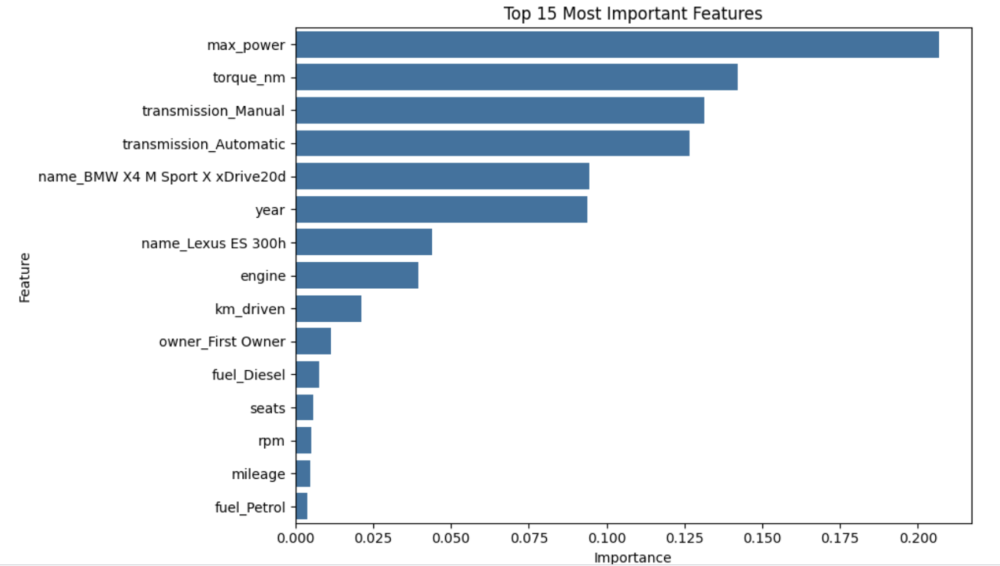
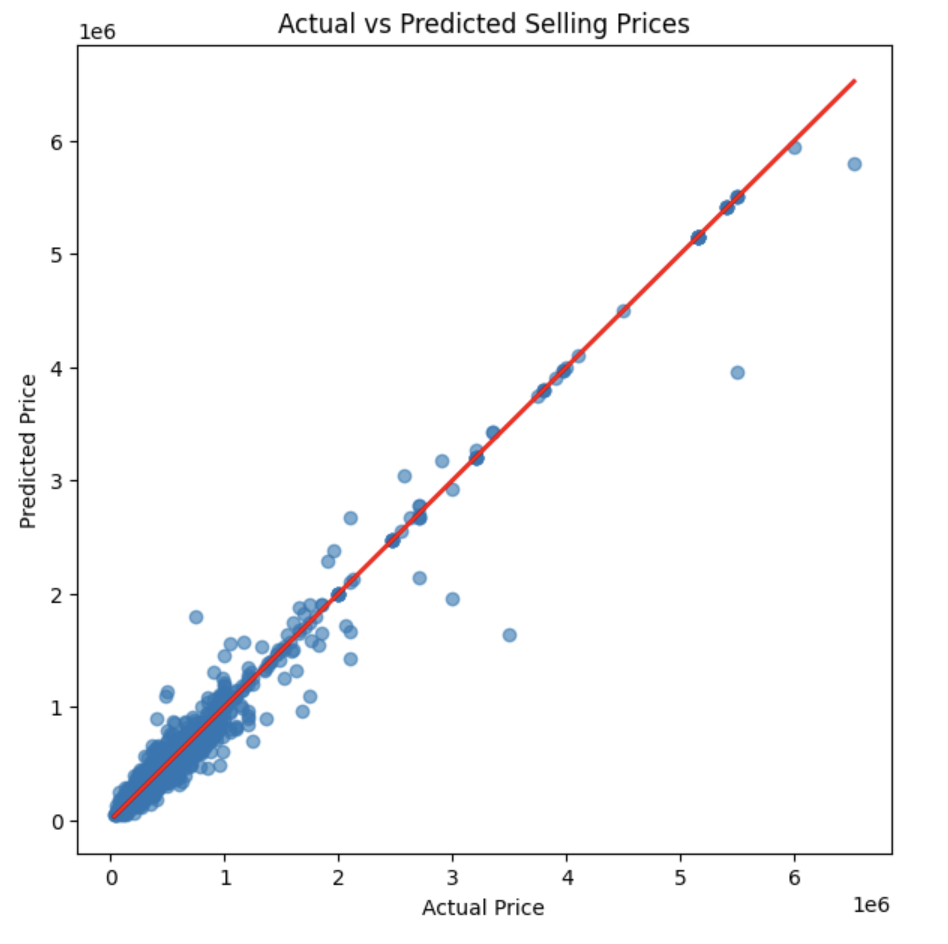
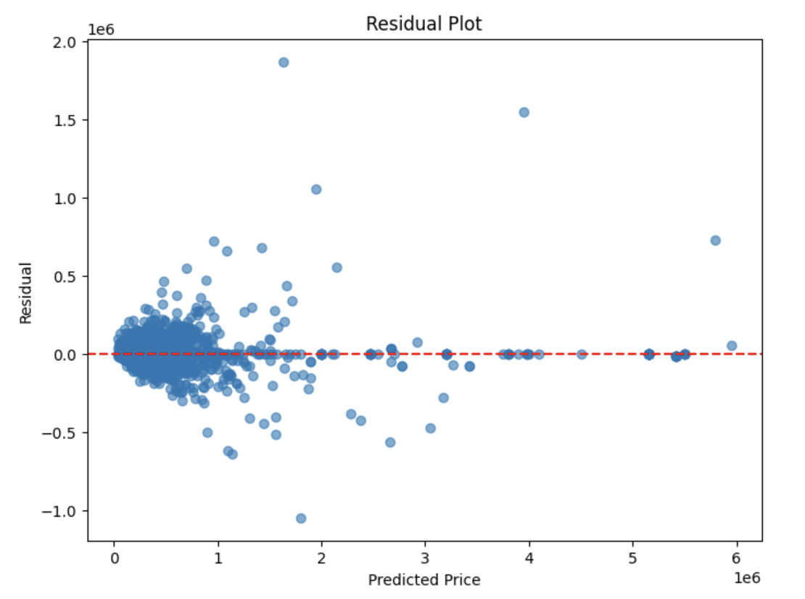
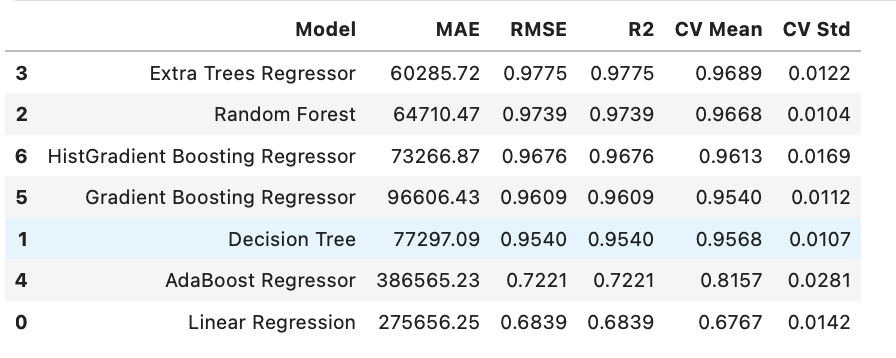

#  Used Car Price Prediction using Ensemble Learning


---

##  Project Overview

This project predicts the **selling price of used cars** using Machine Learning regression models.

The workflow covers the complete Machine Learning pipeline, from data preprocessing and feature engineering to training multiple ensemble models and comparing their performance.

The primary objective was to identify the model that provides the best predictive performance while maintaining strong generalization.

---

##  Dataset

**Source:** CarDekho Used Cars Dataset

The dataset contains information such as:

-  Manufacturing Year
-  Fuel Type
-  Transmission
-  Engine Capacity
-  Maximum Power
-  Torque
-  Seller Type
-  Ownership History
-  Kilometers Driven

**Target Variable**

- **Selling Price**

---

##  Machine Learning Workflow

- Data Cleaning
- Missing Value Handling
- Feature Engineering
- Exploratory Data Analysis
- Data Preprocessing Pipeline
- One-Hot Encoding
- Train-Test Split
- Model Training
- Cross Validation
- Model Comparison
- Feature Importance Analysis
- Residual Analysis

---

##  Models Implemented

- Linear Regression
- Decision Tree Regressor
- Random Forest Regressor
- Extra Trees Regressor 
- AdaBoost Regressor
- Gradient Boosting Regressor
- Histogram Gradient Boosting Regressor

---

#  Model Performance

| Model | MAE | R² Score | CV Mean |
|------|------:|------:|------:|
|  Extra Trees Regressor | ₹60,286 | **0.9775** | **0.9689** |
| Random Forest Regressor | ₹64,710 | 0.9739 | 0.9668 |
| HistGradient Boosting | ₹73,267 | 0.9676 | 0.9613 |
| Gradient Boosting | ₹96,606 | 0.9609 | 0.9540 |
| Decision Tree | ₹77,297 | 0.9540 | 0.9568 |
| AdaBoost | ₹386,565 | 0.7221 | 0.8157 |
| Linear Regression | ₹275,656 | 0.6839 | 0.6767 |

---

##  Best Model

**Extra Trees Regressor**

### Performance

- **MAE:** ₹60,286
- **R² Score:** **0.9775**
- **Cross Validation Mean:** **0.9689**

The Extra Trees Regressor achieved the highest predictive performance while maintaining excellent generalization across cross-validation folds.

---

#  Visualizations

##  Feature Importance



---

##  Actual vs Predicted Prices



---

##  Residual Analysis



---

##  Model Comparison



---

#  Tech Stack

- Python
- Pandas
- NumPy
- Matplotlib
- Seaborn
- Scikit-learn
- Jupyter Notebook

---

#  Repository Structure

```text
Used-Car-Price-Prediction/
│
├── notebook/
│   └── used_car_price_prediction.ipynb
│
├── images/
│   ├── feature_importance.png
│   ├── actual_vs_predicted.png
│   ├── residual_plot.png
│   └── model_comparison.png
│
├── requirements.txt
├── README.md
└── LICENSE
```

---

#  Key Learnings

- Built reusable preprocessing pipelines.
- Performed feature engineering on real-world automotive data.
- Compared multiple regression algorithms.
- Applied ensemble learning techniques.
- Evaluated models using Cross Validation.
- Interpreted model behavior through feature importance and residual analysis.

---

#  Future Improvements

- Hyperparameter tuning using RandomizedSearchCV
- SHAP Explainability
- Model deployment using Streamlit
- Prediction API using FastAPI
- Docker containerization

---

##  If you found this project useful, consider giving it a star!
